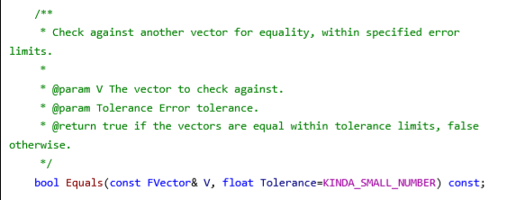

2018年3月1日

起草者：
* 姚旭(yaoxu@h3d.com.cn)

参与者:

本文档按照cpp提供的语法特性来划分，会涉及如下相关的规范和建议:

* [注释规范](#S-comment)
* 接口规范
* class规范
* 模板与泛型编程规范
* 标准库使用规范
* cpp11规范
* 命名建议
* 排版建议

规范并不能覆盖到每个方面，以下是来自CppCoreGuidelines而上面又没有完整覆盖到的分类

* 代码哲学
* 资源管理
* 错误处理
* 性能

#  注释规范
注释规范应该是最重要，最容易被执行，最容易被忽略的规范。对于注释规范，每个人在执行时不仅要对自己代码改进，并且需要对相关代码进行修正，相关代码是一个不明确的概念，这取决于个人的洁癖程度，但至少:

* 修改某函数的某一行，整个函数中的注释都应该被规范
注释规范不是规范格式，而是规范要写什么内容。

# C.0 建议在接口上使用doxygen工具支持的注释写法
[doxygen](http://www.doxygen.nl/)是一个使用足够广泛的格式规范并且配套工具,在一些IDE甚至被内建支持,以至于有人认为这是JavaDoc规则

>"doxygen的大概写法"